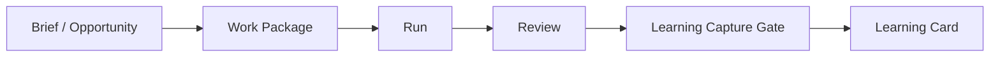

# Halucy Foundation

## Purpose

Halucy는 **AI-native 인디 게임 제작 프로젝트**다. 목표는 기존 AI 에이전트 플랫폼 및 오픈소스 프로젝트를 참고하고 Halucy에 맞게 최적화해서, 역할이 분리된 AI 에이전트들이 playable indie game prototype을 실제로 만들 수 있는지 검증하는 것이다.

Halucy가 먼저 만들 것은 에이전트 플랫폼이 아니다. 먼저 검증해야 할 것은 **에이전트 조직, 게임 제작 워크플로우, durable learning 구조가 실제 프로토타입 제작에 유효한가**다.

## Current Decisions

- Halucy는 인디 게임을 제작하는 AI-native 프로젝트다.
- 장르는 하이퍼캐주얼에 국한하지 않는다.
- 기존 AI 에이전트 플랫폼과 오픈소스 프로젝트는 참고, 최적화, 필요 시 fork 대상이다.
- prototype track은 Godot desktop/web-capable target으로 시작했다.
- 에이전트 역할은 문서상 구분에 그치지 않고 실제 prototype 제작에 사용한다.
- 현재 기본 역할은 Research Agent, Art Agent, Implementation Agent, QA Agent, Learning Librarian Agent로 둔다.
- Human Creative Owner가 creative/product 방향과 Canonical/Policy 판단 권한을 가진다.
- Implementation과 QA는 분리한다.
- 학습은 raw log가 아니라 Learning Card로 자산화한다.
- Learning Card는 status-first store에 저장한다: `candidate`, `working`, `canonical`, `policy`.
- Candidate와 Working은 에이전트가 생성하거나 제안할 수 있지만, Canonical과 Policy는 더 강한 검토 기준이 필요하다.
- 계획은 고정된 달력이 아니라 Phase로 관리한다.
- 현재 다음 production boundary는 Phase 4B Complex Prototype Production Validation이다.

## Non-Goals

현재 Halucy가 하지 않을 일:

- 에이전트 플랫폼 자체를 제품으로 만드는 것
- 게임 엔진을 여러 개 동시에 지원하는 것
- 모든 학습 후보를 사람이 직접 승인하는 운영 모델을 고정하는 것
- raw transcript를 장기 맥락으로 취급하는 것
- 게임 후보 확정 전에 과도한 자동화를 먼저 만드는 것

## Architecture Principles

### 1. Agent Organization Is the Production Method

에이전트 조직은 보기 좋은 역할표가 아니라 실제 제작 방식이다. Research, Art, Implementation, QA, Learning Librarian은 Phase 1부터 산출물을 주고받아야 한다.

### 2. Work Package Is the Execution Unit

작업은 Work Package 없이 시작하지 않는다. Work Package는 목표, 입력, target, 금지 범위, 산출물, 검증, handoff를 가져야 한다.

### 3. Review Is Separate from Implementation

Implementation Agent가 만든 결과는 QA Agent가 독립적으로 검토한다. QA는 bug뿐 아니라 playability, onboarding, feel도 검토한다.

### 4. Learning Must Become an Asset

반복 가능한 lesson만 Learning Card가 된다. 단순 작업 로그, 의견, TODO, 코드 변경 목록은 durable context가 아니다.

### 5. Human Authority Stays Explicit

사람은 creative/product 방향, concept choice, Canonical promotion, Policy promotion의 최종 권한을 가진다.

### 6. Automation Follows Evidence

자동화는 생산 루프에서 반복 병목이 확인된 뒤 붙인다. 처음부터 모든 결정을 자동화하지 않는다.

## Current Agent Organization

| Role | Owns | Main Outputs | Must Not Own |
|---|---|---|---|
| Research Agent | 시장, 레퍼런스, 사전 조사, 런칭 후 신호 조사 | research brief, reference pack, feedback signal report | 최종 concept 결정 |
| Art Agent | 스타일 방향, 에셋 후보, 에셋 프롬프트, 시각 검토 | style board, asset manifest, visual QA note | 최종 creative direction |
| Implementation Agent | Godot 구현, local build, scripts, scene 구조 | changed files, build artifact, run note | 자기 작업물 최종 QA |
| QA Agent | 독립 검토, playability, bug, onboarding, feel | QA report, rework issues, pass/fail decision | 구현 수정 직접 소유 |
| Learning Librarian Agent | Learning Card 후보, 중복 탐지, evidence 연결 | Candidate Learning Cards, promotion suggestions | Canonical/Policy 최종 승인 |
| Human Creative Owner | creative/product 방향, 최종 판단 | approval, rejection, scope decision | routine execution |

## Artifact Lifecycle



Minimum artifact contract:

- Work Package: what to do, what to touch, what not to touch, how to verify
- Run: who executed, with which tools, what artifacts were created
- Review: what passed, what failed, what needs rework, whether human judgment is required
- Learning Card: one reusable lesson, evidence, scope, reuse rule, status

## Learning Model

Learning Card types:

- `concept`
- `production`
- `technical`
- `market`
- `failure`
- `prompt`

Learning Card statuses:

- `Candidate`: searchable low-authority learning candidate
- `Working`: provisional learning that may guide current work
- `Canonical`: high-authority learning future agents may use as default context
- `Policy`: operating rule or prohibition

Promotion model:

- `Candidate -> Working`: agent review can suggest or perform when evidence is clear enough for current work.
- `Working -> Canonical`: human approval or later strong review protocol required.
- `Canonical -> Policy`: human approval required.

Current validation loops default to Candidate-only capture unless a separate
approved Work Package explicitly authorizes promotion.

## Phase Status And Plan

### Completed Evidence: Phase 0-3

Phase 0 fixed the architecture contract: agent profiles, Work Package, Run,
Review, Learning Card schemas, role handoff map, Godot target, and GitHub sync
direction.

Phase 1 proved a tiny Research -> Art -> Owner -> Implementation -> QA ->
Learning loop on a Godot readability slice.

Phase 2 proved the role-separated production harness can create a playable
platformer greybox with QA and BK/Human Creative Owner feel judgment.

Phase 3 proved Art Agent production capability: tool-assisted art candidates,
owner redirect/rework, implementation handoff, transparent asset prep, Godot
import, QA, and BK direct test approval.

These phases do not approve final game concept, launch readiness, final art,
external tester workflow, platform feedback, or broad gameplay expansion.

### Phase 4A. Production System Retrospective

Phase 4A synthesizes Phase 0-3 evidence and creates the decision surface for
Phase 4B. It does not close Phase 4 by itself.

Outputs:

- `production_retrospectives/PR-2026W22-001-phase4a-production-system-retrospective-KR.md`
- `plans/PHASE4B_COMPLEX_PROTOTYPE_VALIDATION_PLAN.md`
- role handoff, QA gate, Learning Card triage, automation, and repo hygiene decisions

Pass:

- Phase 0-3 evidence is separated from assumptions
- role boundaries and handoffs are classified as keep, revise, defer, or remove
- Phase 4B can start from a bounded production validation plan
- no Learning Card promotion is executed without separate authority

### Phase 4B. Complex Prototype Production Validation

Phase 4B is the current next production boundary. It is not final game
development; it is a controlled stress test of whether Halucy's production
system can build a more complex playable prototype than the Phase 2 greybox and
Phase 3 art import test.

Recommended boundary:

```text
Two-section platformer challenge with one hazard or moving obstacle, collectible/progression state, simple result/retry UI, camera follow or section framing, and at least one imported gameplay-readable asset category.
```

Required sequence:

```text
Phase 4B Scope/Game Brief
-> Research Agent constraints
-> Art Agent requirements and candidate package
-> BK/Human Creative Owner scope/art review
-> Implementation Agent Godot slice
-> QA Agent technical/playability review
-> BK/Human Creative Owner direct play/feel review
-> Learning Librarian Candidate capture
-> Closeout verification
```

Pass:

- Work Package based execution holds under higher prototype complexity
- Implementation and QA remain separate
- owner approval happens before implementation and owner feel judgment closes the playable gate
- QA covers schema, smoke cleanliness, headless runtime, scope, imported asset metadata when applicable, and target-file diff review
- Learning capture stays Candidate-only unless a separate approved Work Package authorizes promotion
- repo hygiene decisions for `.gd.uid`, `.png.import`, `.godot/`, and active Work Package lifecycle are explicit

### Deferred Later Loops

External or semi-external feedback, release/platform feedback, launch planning,
monetization, and market-position validation are deferred until the target
platform, distribution path, and audience feedback channel are known.

## Source of Truth

- `HALUCY_FOUNDATION.md`: current project foundation and phase plan
- `CONTEXT.md`: controlled vocabulary and learning terminology
- `Halucy Codex 구현 계획.md`: implementation contract and repo skeleton plan
- `templates/learning-card.md`: Learning Card format
- `AGENTS.md` and `CLAUDE.md`: tool-specific startup shims only, not canonical policy sources

When these conflict, update `HALUCY_FOUNDATION.md` first, then propagate the decision into the more specific document.

## Current Next Boundary

Start Phase 4B only after BK/Human Creative Owner accepts the complex prototype
validation boundary. The next execution unit should be the Phase 4B Scope/Game
Brief Work Package described in `plans/PHASE4B_COMPLEX_PROTOTYPE_VALIDATION_PLAN.md`.
