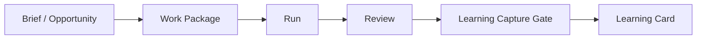

# Halucy Foundation

## Purpose

Halucy는 **AI-native 인디 게임 제작 프로젝트**다. 목표는 기존 AI 에이전트 플랫폼 및 오픈소스 프로젝트를 참고하고 Halucy에 맞게 최적화해서, 역할이 분리된 AI 에이전트들이 playable indie game prototype을 실제로 만들 수 있는지 검증하는 것이다.

Halucy가 먼저 만들 것은 에이전트 플랫폼이 아니다. 먼저 검증해야 할 것은 **에이전트 조직, 게임 제작 워크플로우, durable learning 구조가 실제 프로토타입 제작에 유효한가**다.

## Current Decisions

- Halucy는 인디 게임을 제작하는 AI-native 프로젝트다.
- 장르는 하이퍼캐주얼에 국한하지 않는다.
- 기존 AI 에이전트 플랫폼과 오픈소스 프로젝트는 참고, 최적화, 필요 시 fork 대상이다.
- 초기 prototype은 Godot desktop/web-capable target으로 시작한다.
- 에이전트 역할은 문서상 구분에 그치지 않고 실제 prototype 제작에 사용한다.
- 초기 역할은 Research Agent, Art Agent, Implementation Agent, QA Agent, Learning Librarian Agent로 둔다.
- Human Creative Owner가 creative/product 방향과 Canonical/Policy 판단 권한을 가진다.
- Implementation과 QA는 분리한다.
- 학습은 raw log가 아니라 Learning Card로 자산화한다.
- Learning Card는 status-first store에 저장한다: `candidate`, `working`, `canonical`, `policy`.
- Candidate와 Working은 에이전트가 생성하거나 제안할 수 있지만, Canonical과 Policy는 더 강한 검토 기준이 필요하다.
- 계획은 고정된 달력이 아니라 Phase로 관리한다.

## Non-Goals

초기 Halucy가 하지 않을 일:

- 에이전트 플랫폼 자체를 제품으로 만드는 것
- 게임 엔진을 여러 개 동시에 지원하는 것
- 모든 학습 후보를 사람이 직접 승인하는 운영 모델을 고정하는 것
- raw transcript를 장기 맥락으로 취급하는 것
- 게임 후보 확정 전에 과도한 자동화를 먼저 만드는 것

## Architecture Principles

### 1. Agent Organization Is the Production Method

에이전트 조직은 보기 좋은 역할표가 아니라 실제 제작 방식이다. Research, Art, Implementation, QA, Learning Librarian은 Phase 1부터 산출물을 주고받아야 한다.

### 2. Work Package Is the Execution Unit

작업은 Work Package 없이 시작하지 않는다. Work Package는 목표, 입력, target, 금지 범위, 산출물, 검증, handoff를 가져야 한다.

### 3. Review Is Separate from Implementation

Implementation Agent가 만든 결과는 QA Agent가 독립적으로 검토한다. QA는 bug뿐 아니라 playability, onboarding, feel도 검토한다.

### 4. Learning Must Become an Asset

반복 가능한 lesson만 Learning Card가 된다. 단순 작업 로그, 의견, TODO, 코드 변경 목록은 durable context가 아니다.

### 5. Human Authority Stays Explicit

사람은 creative/product 방향, concept choice, Canonical promotion, Policy promotion의 최종 권한을 가진다.

### 6. Automation Follows Evidence

자동화는 생산 루프에서 반복 병목이 확인된 뒤 붙인다. 처음부터 모든 결정을 자동화하지 않는다.

## Initial Agent Organization

| Role | Owns | Main Outputs | Must Not Own |
|---|---|---|---|
| Research Agent | 시장, 레퍼런스, 사전 조사, 런칭 후 신호 조사 | research brief, reference pack, feedback signal report | 최종 concept 결정 |
| Art Agent | 스타일 방향, 에셋 후보, 에셋 프롬프트, 시각 검토 | style board, asset manifest, visual QA note | 최종 creative direction |
| Implementation Agent | Godot 구현, local build, scripts, scene 구조 | changed files, build artifact, run note | 자기 작업물 최종 QA |
| QA Agent | 독립 검토, playability, bug, onboarding, feel | QA report, rework issues, pass/fail decision | 구현 수정 직접 소유 |
| Learning Librarian Agent | Learning Card 후보, 중복 탐지, evidence 연결 | Candidate Learning Cards, promotion suggestions | Canonical/Policy 최종 승인 |
| Human Creative Owner | creative/product 방향, 최종 판단 | approval, rejection, scope decision | routine execution |

## Artifact Lifecycle

Minimum artifact contract:

- Work Package: what to do, what to touch, what not to touch, how to verify
- Run: who executed, with which tools, what artifacts were created
- Review: what passed, what failed, what needs rework, whether human judgment is required
- Learning Card: one reusable lesson, evidence, scope, reuse rule, status

## Learning Model

Learning Card types:

- `concept`
- `production`
- `technical`
- `market`
- `failure`
- `prompt`

Learning Card statuses:

- `Candidate`: searchable low-authority learning candidate
- `Working`: provisional learning that may guide current work
- `Canonical`: high-authority learning future agents may use as default context
- `Policy`: operating rule or prohibition

Promotion model:

- `Candidate -> Working`: agent review can suggest or perform when evidence is clear enough for current work.
- `Working -> Canonical`: human approval or later strong review protocol required.
- `Canonical -> Policy`: human approval required.

## Phase Plan

### Phase 0. Architecture Contract

Lock the operating contract before real production expands.

Outputs:

- agent profile schema
- Work Package schema
- Run schema
- Review schema
- Learning Card schema
- role handoff map
- Godot desktop/web target decision
- GitHub repo sync decision

Pass:

- each agent has clear inputs, outputs, authority, forbidden scope
- Work Package to Learning Card evidence path is traceable
- human decision points are explicit

### Phase 1. Role-Separated Production Dry Run

Run one small production loop with separated roles before committing to a full prototype.

Outputs:

- Research Agent note
- Art Agent note
- Implementation Agent tiny Godot slice
- QA Agent review
- Learning Librarian Candidate Learning Card

Pass:

- handoffs work as written
- QA is independent from implementation
- one Learning Capture Gate closes cleanly

### Phase 2. Playable Vertical Slice

Use the separated agents to create a playable core loop.

Outputs:

- game brief
- reference pack
- style board or asset manifest
- Godot greybox
- first playable build
- QA report
- Candidate Learning Cards

Pass:

- player-facing hook is testable
- build and smoke test pass
- human creative review is recorded

### Phase 3. External Feedback Loop

Feed external or semi-external feedback back into production.

Outputs:

- feedback report
- rework Work Packages
- revised build
- Working Learning Card candidates

Pass:

- feedback changes the work plan
- repeated signals become Learning Cards
- prototype decision has evidence

### Phase 4. Production System Retrospective

Judge whether Halucy's production system is reusable for the next prototype.

Outputs:

- production retrospective
- Canonical candidates
- agent profile revision proposal
- next prototype plan
- automation candidate list

Pass:

- reusable lessons are separated from one-off noise
- next loop can start from updated context
- automation candidates are evidence-backed

## Source of Truth

- `HALUCY_FOUNDATION.md`: current project foundation and phase plan
- `CONTEXT.md`: controlled vocabulary and learning terminology
- `Halucy Codex 구현 계획.md`: implementation contract and repo skeleton plan
- `templates/learning-card.md`: Learning Card format

When these conflict, update `HALUCY_FOUNDATION.md` first, then propagate the decision into the more specific document.

## Immediate Next Step

After this foundation is reviewed, write `schemas/agent_profile.schema.json` first. Do not start game candidate selection until the profile schema and initial agent profile files are stable enough to run Phase 1.
