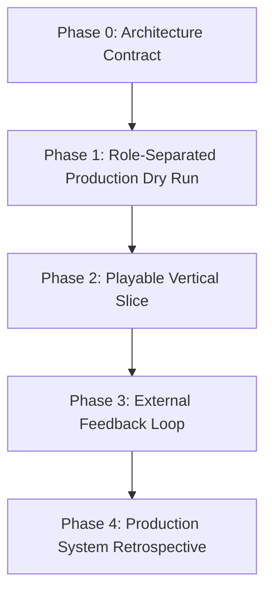

# Halucy Codex 구현 계획

## Executive Summary

Halucy의 초기 구현 목표는 **에이전트 역할을 분리해서 Godot desktop/web-capable playable prototype을 실제로 제작할 수 있는지 검증하는 것**이다. 계획 단위는 고정된 달력이 아니라 Phase다. 기간은 운영 압박으로 따로 관리할 수 있지만, 아키텍처와 산출물은 Phase Gate를 기준으로 고정한다.

우선순위는 **기반 문서 고정 → agent profile schema → Work Package/Run/Review/Learning Card schema → repo 골격 → Review Gate → 실행 어댑터 thin slice → 관측/모델 라우팅 연동 후보 검증** 순서다.

핵심 원칙:

- 모든 실행 작업은 Work Package로만 시작한다.
- 에이전트별 입력, 출력, 권한, 금지 범위를 명시한다.
- Implementation과 QA는 분리해서 자기 작업물 자체 검토를 피한다.
- Research와 Art는 Codex 단독이 아니라 외부 도구 또는 연동을 전제로 설계한다.
- Learning은 hidden memory가 아니라 `Learning Card`로 남긴다.
- 사람은 creative/product 방향과 Canonical/Policy 수준 판단 권한을 유지한다.

## 레포지토리 골격

```text
halucy/
  context/
    game_brief.md
    style_bible.md
    constraints.md
  agents/
    profiles/
      research_agent.yaml
      art_agent.yaml
      implementation_agent.yaml
      qa_agent.yaml
      learning_librarian_agent.yaml
  game/
    project.godot
    scenes/
    scripts/
    assets/
  schemas/
    agent_profile.schema.json
    work_package.schema.json
    run.schema.json
    review.schema.json
    learning_card.schema.json
  work_packages/{backlog,active,done}/
  runs/
  reviews/
  learning_cards/{candidate,working,canonical,policy}/
  adapters/{executor,model_router,tool_bridge,observability}/
  scripts/
    init.sh
    run_wp.py
    build_game.sh
    smoke_test.sh
    review_gate.py
    promote_card.py
  tests/
    test_schema.py
    test_gate.py
    test_run_flow.py
  .github/workflows/ci.yml
  Makefile
```

## 데이터 스키마

고정 ID:

- Agent Profile: `AGENT-{role}`
- Work Package: `WP-YYYYWW-NNN`
- Run: `RUN-YYYYMMDD-NNN`
- Review: `RV-YYYYMMDD-NNN`
- Learning Card: `LC-YYYYMMDD-NNN`

| 엔티티 | 필수 필드 | 검증 |
|---|---|---|
| AgentProfile | id, role, owns, inputs, outputs, tools, decision_rights, forbidden_scope, handoff_to | JSON Schema + role 중복 금지 |
| WP | id, type, goal, owner_agent, inputs, targets, forbidden_changes, outputs, verify, handoff | JSON Schema + target 존재 |
| Run | run_id, work_package_id, agent, model, tool_calls, status, artifacts | schema + artifact 존재 |
| Review | review_id, run_id, reviewer_agent, checks, human_decision, issues | gate all green 또는 명시 rework |
| LC | id, type, status, claim, evidence, scope, reuse_rule | evidence 링크 필수 |

```yaml
# agents/profiles/implementation_agent.yaml
id: AGENT-implementation
role: implementation
owns:
  - Godot scene/script implementation
  - local build flow
inputs:
  - approved Work Package
  - context/game_brief.md
  - context/style_bible.md
outputs:
  - changed target files
  - run artifact
  - implementation note
tools:
  - Codex
  - Godot CLI
decision_rights:
  - technical implementation inside approved target scope
forbidden_scope:
  - creative direction change without Human Creative Owner approval
  - art style change without Art Agent handoff
handoff_to:
  - qa
  - learning_librarian
```

```yaml
# work_packages/active/WP-2026W22-001.yaml
id: WP-2026W22-001
type: implementation
goal: "player input core loop 구현"
owner_agent: implementation
inputs: ["context/game_brief.md"]
targets: ["game/scripts/player.gd"]
forbidden_changes: ["game/assets/**"]
outputs: ["runs/RUN-*.json", "game/scripts/player.gd"]
verify: ["scripts/build_game.sh", "scripts/smoke_test.sh"]
handoff: ["qa", "learning_librarian"]
```

```json
{
  "run_id": "RUN-20260525-001",
  "work_package_id": "WP-2026W22-001",
  "agent": "implementation",
  "status": "passed",
  "artifacts": ["runs/RUN-20260525-001/log.txt"]
}
```

```md
# Review
review_id: RV-20260525-001
run_id: RUN-20260525-001
reviewer_agent: qa
decision: rework
issues: ["scope_violation", "no_human_fun_check"]
```

## 실행 계약

초기 실행 계약은 특정 제품을 먼저 만드는 것이 아니라 Halucy 생산 루프의 안정성을 검증하기 위한 최소 연결면이다.

- Godot: `scripts/build_game.sh`와 `scripts/smoke_test.sh`가 로컬 검증 기준이다.
- Codex: Implementation Agent와 QA Agent의 기본 실행 환경으로 사용한다.
- Research Agent: 시장 조사, 레퍼런스 조사, 런칭 후 반응 조사에 외부 리서치 도구를 사용할 수 있게 profile에 tool contract를 둔다.
- Art Agent: 이미지 생성, 스타일 보드, 에셋 후보 생성, 에셋 리뷰 도구를 profile에 tool contract로 둔다.
- 모델 라우팅: 초기에는 수동 또는 단순 설정으로 시작하고, 비용/품질 근거가 쌓인 뒤 별도 정책화한다.
- 관측 기록: Run, Review, Learning Card evidence로 추적 가능해야 한다.
- 오픈소스 참고 또는 fork: 생산 루프에 직접 도움이 되는 executor, rules loader, diff capture, tool bridge 범위에서만 검토한다.

## 빌드 및 검증 파이프라인

로컬 기준:

```bash
make init
make test
make build-game
make gate WP=WP-2026W22-001
```

CI 기준:

```text
schema lint -> unit test -> Godot import/build -> smoke_test -> review_gate -> artifact upload
```

핵심 테스트:

- schema valid
- AgentProfile role 중복 없음
- WP target 외 diff reject
- Godot desktop/web-capable build 성공
- 첫 scene load 성공
- QA review 없으면 merge fail
- Human Creative Owner가 필요한 creative/product 결정 누락 시 fail
- Learning Card는 evidence와 reuse_rule 없으면 complete 처리 금지

## Phase Plan



### Phase 0. Architecture Contract

목표: 실제 제작 전에 최소 운영 계약을 고정한다.

산출물:

- `agent_profile.schema.json`
- `work_package.schema.json`
- `run.schema.json`
- `review.schema.json`
- `learning_card.schema.json`
- agent profile 초안 5종
- role handoff map
- Godot desktop/web-capable target 결정
- GitHub repo 연동 방식 결정

통과 기준:

- 각 에이전트의 입력, 출력, 권한, 금지 범위가 명확하다.
- Work Package에서 Run, Review, Learning Card evidence까지 추적 가능하다.
- 어떤 판단을 사람이 해야 하는지 문서에 드러난다.

### Phase 1. Role-Separated Production Dry Run

목표: 실제 게임 후보를 확정하기 전에 작은 작업 흐름으로 에이전트 분리와 핸드오프를 검증한다.

산출물:

- Research Agent reference note
- Art Agent style/asset note
- Implementation Agent Godot tiny slice
- QA Agent review
- Learning Librarian Candidate Learning Card

통과 기준:

- 각 에이전트 산출물이 다음 에이전트의 입력으로 재사용된다.
- Implementation과 QA가 분리되어 기록된다.
- Learning Capture Gate가 한 번 닫힌다.

### Phase 2. Playable Vertical Slice

목표: 역할 분리된 에이전트 생산 구조로 실제 playable core loop를 만든다.

산출물:

- game brief
- reference pack
- style board 또는 asset manifest
- Godot greybox
- first playable build
- QA report
- Candidate Learning Cards

통과 기준:

- 플레이어가 조작 가능한 core loop가 있다.
- 빌드와 smoke test가 통과한다.
- 재미, 이해 가능성, 조작감에 대한 QA와 사람 판단이 기록된다.

### Phase 3. External Feedback Loop

목표: 외부 또는 준외부 피드백을 production loop에 다시 넣는다.

산출물:

- feedback report
- revised Work Packages
- rework build
- Working Learning Card 후보

통과 기준:

- 피드백이 단순 의견이 아니라 수정 작업으로 연결된다.
- 반복되는 신호가 Learning Card로 분리된다.
- 다음 prototype decision에 영향을 줄 근거가 남는다.

### Phase 4. Production System Retrospective

목표: Halucy의 에이전트 조직과 학습 구조가 다음 프로토타입에도 재사용 가능한지 판단한다.

산출물:

- production retrospective
- Canonical 후보 Learning Cards
- agent profile revision proposal
- next prototype plan
- automation candidate list

통과 기준:

- 유지할 역할, 바꿀 역할, 제거할 역할이 결정된다.
- Canonical 승격 후보와 보류 사유가 분리된다.
- 다음 제작 루프의 첫 Work Package가 작성 가능하다.

## 포크 범위 및 주의사항

오픈소스 fork는 "폼"이 아니라 생산 루프의 병목을 줄일 때만 한다. 초기 검토 범위는 다음으로 제한한다.

- executor invocation
- project rules loading
- changed file capture
- tool bridge pattern
- run artifact persistence

보안 및 운영 주의:

- secret은 env만 사용한다.
- logs에 API key나 개인 토큰을 남기지 않는다.
- 외부 asset license는 Art Agent 산출물과 별도 검수한다.
- 모델 routing 정책, trace retention, Canonical threshold 수치는 Phase 0 이후 별도 결정한다.
