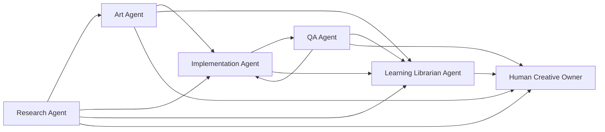

# Halucy Agent Handoff Map

This map documents the role handoffs already allowed by `agents/profiles/*.yaml`. It does not create new authority, automate routing, or replace Work Package, Run, Review, or Learning Card records.

## Overview

Halucy uses role-separated agents to produce playable indie game prototypes. A handoff is allowed only when the receiving role is listed in the sender's `handoff_to` field.

## Primary Flow

## Handoff Table

| From | To | Trigger | Required Inputs | Expected Outputs | Handoff Artifacts | Stop Condition |
|---|---|---|---|---|---|---|
| Research Agent | Art Agent | Opportunity or reference work is ready for visual exploration. | research question, constraints, source notes | visual direction inputs | research brief, reference pack | Evidence is too weak to support visual direction. |
| Research Agent | Implementation Agent | A mechanics or technical reference can inform a prototype slice. | reference notes, constraints, mechanic summary | implementation-ready context | research brief, reference pack | Research implies a concept change requiring Human Creative Owner judgment. |
| Research Agent | Learning Librarian Agent | Research reveals a reusable market, concept, failure, or prompt lesson. | research findings, source notes | Candidate Learning Card draft or non-learning decision | research brief, source references | Finding is only trivia or has no future decision impact. |
| Research Agent | Human Creative Owner | Concept, audience, or opportunity decision is needed. | opportunity options, evidence strength, risk notes | accept, reject, or redirect decision | research brief, research risk note | Evidence does not support a decision. |
| Art Agent | Implementation Agent | Style direction or asset candidates are ready for prototype use. | style direction, asset manifest, usage notes | implementation-ready asset context | style board, asset manifest, asset prompt set | Asset license or usage risk is unresolved. |
| Art Agent | QA Agent | Visual output needs consistency or player-understanding review. | visual direction, asset candidates, expected player read | visual QA findings | visual review note, asset manifest | Final creative direction lacks required human judgment. |
| Art Agent | Learning Librarian Agent | Visual workflow or prompt pattern may be reusable. | asset prompt set, visual review note, handoff risks | Candidate Learning Card draft or non-learning decision | prompt record, visual review note | Lesson combines multiple unrelated claims. |
| Art Agent | Human Creative Owner | Final visual direction, usage risk, or positioning change needs judgment. | style options, asset candidates, risk notes | creative judgment, rejection, or redirect | style board, visual review note | Requested change would alter product direction without explicit human judgment. |
| Implementation Agent | QA Agent | A scoped implementation run is complete or blocked. | changed target files, build output, run note | independent QA review | Run artifact, changed file list, verification note | Implementation touched unauthorized scope and needs rework before QA. |
| Implementation Agent | Learning Librarian Agent | Implementation reveals a reusable technical, production, failure, or prompt lesson. | run artifact, risk note, verification result | Candidate Learning Card draft or non-learning decision | run artifact, command output references | Issue is a one-off code change without reuse value. |
| QA Agent | Implementation Agent | Review finds rework needed. | QA report, issue list, expected behavior | revised Work Package or implementation rework | Review record, rework issues | Issue requires Human Creative Owner judgment before rework. |
| QA Agent | Learning Librarian Agent | Review reveals a reusable defect, gate, or playability lesson. | QA report, scope findings, issue patterns | Candidate Learning Card draft or non-learning decision | Review record, issue references | Finding is routine task feedback with no durable lesson. |
| QA Agent | Human Creative Owner | Playable feel, issue acceptance, or phase gate judgment is required. | QA report, pass/rework recommendation, known issues | phase judgment or scope decision | Review record, playability note | QA evidence is insufficient for human decision. |
| Learning Librarian Agent | Research Agent | A Candidate Learning Card needs research evidence or source clarification. | draft claim, missing evidence, source question | strengthened or rejected evidence | Candidate draft, evidence gap note | Request would make Research Agent decide final concept. |
| Learning Librarian Agent | Art Agent | A Candidate Learning Card needs visual evidence or prompt clarification. | draft claim, prompt record, visual evidence gap | strengthened or rejected evidence | Candidate draft, visual evidence note | Request would make Art Agent decide final creative direction. |
| Learning Librarian Agent | Implementation Agent | A Candidate Learning Card needs technical evidence or reproduction context. | draft claim, run reference, missing technical evidence | clarified technical evidence | Candidate draft, run reference | Request would make Implementation Agent self-approve QA. |
| Learning Librarian Agent | QA Agent | A Candidate Learning Card needs independent review evidence. | draft claim, review question, related run | clarified review evidence | Candidate draft, QA evidence note | Request would make QA modify implementation under review. |
| Learning Librarian Agent | Human Creative Owner | Canonical or Policy judgment is needed. | Candidate or Working card, evidence, promotion suggestion | accept, reject, or defer judgment | Learning Card draft, promotion note | Evidence is not strong enough for higher-authority memory. |

## Human Authority Points

- Concept selection and opportunity-space acceptance.
- Final prototype visual direction.
- Creative or product-direction changes during implementation.
- Playable feel judgment at phase gates.
- Working to Canonical promotion.
- Canonical to Policy promotion.
- Changes to Learning Card operating rules.

## Non-Handoff Boundaries

- Research Agent does not implement or make final concept decisions.
- Art Agent does not modify gameplay logic or make final creative direction decisions.
- Implementation Agent does not self-QA or change creative/product direction without Human Creative Owner judgment.
- QA Agent does not directly modify implementation under review.
- Learning Librarian Agent does not approve Canonical or Policy Learning Cards.
- Human Creative Owner is an authority point, not a routine execution agent.

## Evidence Links

- Work Package defines the authorized task scope.
- Run records what happened during execution.
- Review records independent judgment about a Run.
- Learning Card records one reusable lesson supported by evidence.
