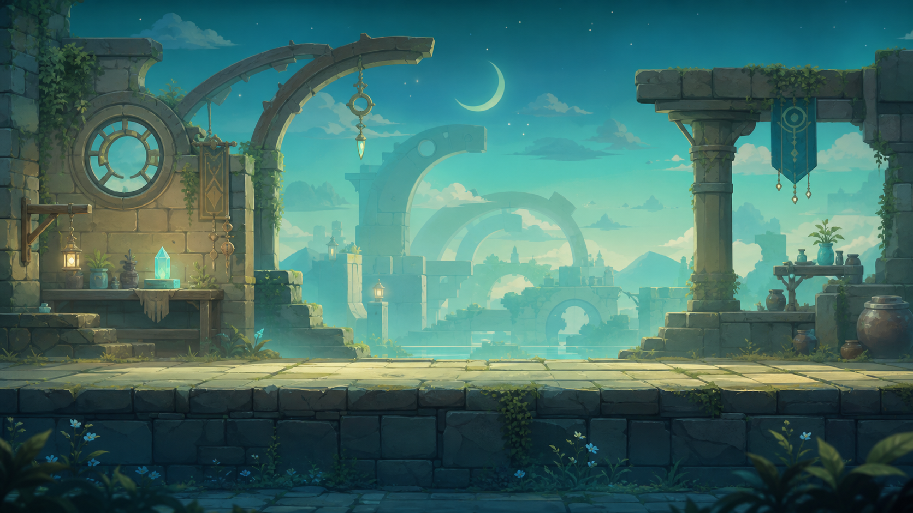
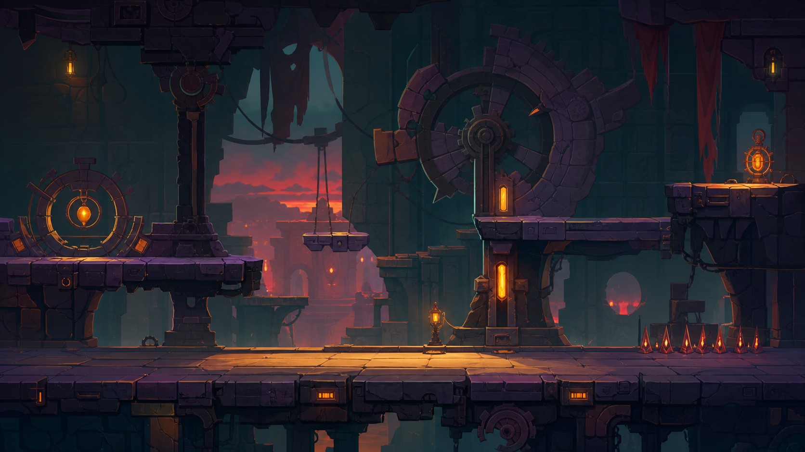
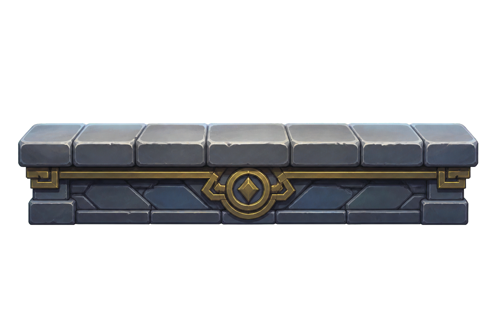
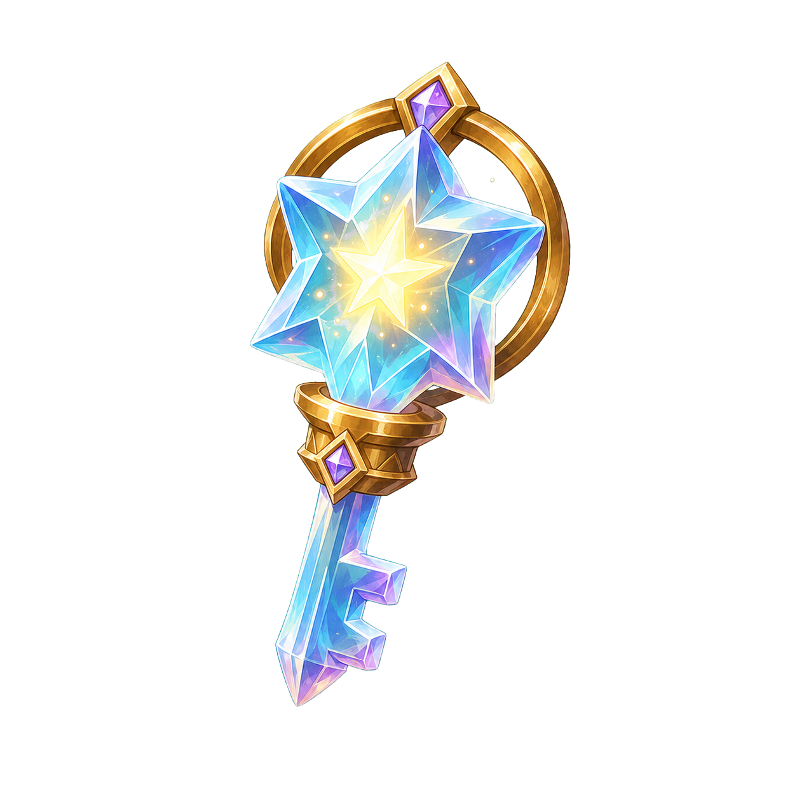
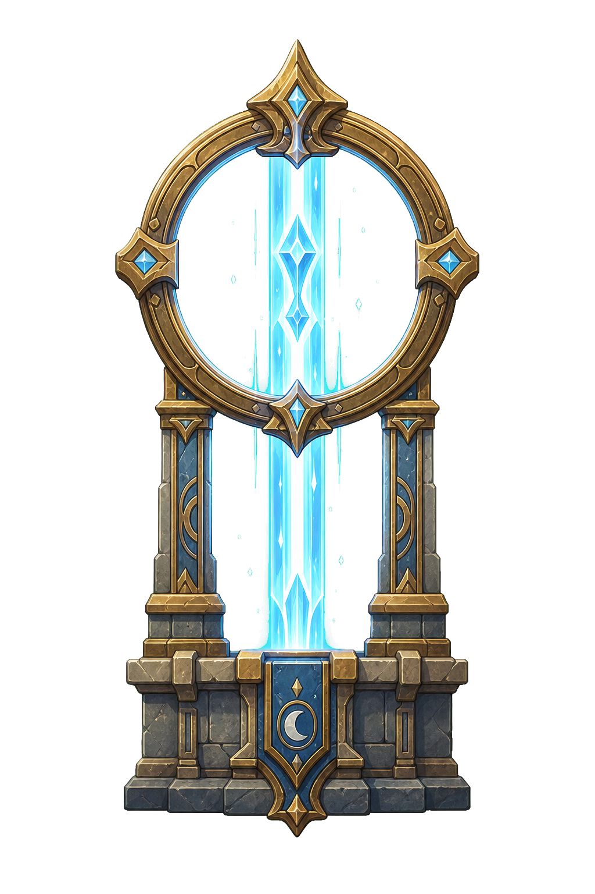
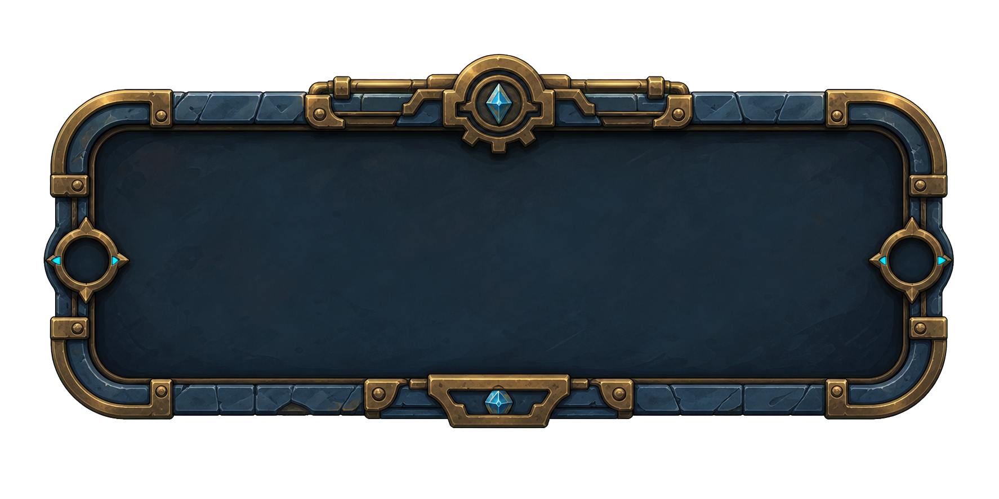

# Phase 4B Direct Art Contact Sheet

Package: `P4B-direct-art-v1`

Work Package: `WP-2026W22-036`

Generation path: `built_in_image_gen` via the Codex `imagegen` skill. No
paid_tool_fallback was used. Sprite/UI assets used a `chroma_key` source and
local background removal.

All assets are `prototype_only_pending_owner_review` and
`production_candidate_not_approved`. `human_final_pass_required` remains true
before any launch use.

## Backgrounds

### background_section_one_v1

Role: Section 1 warmup background.

Implementation handoff note: may replace Section 1 background only after BK
approval and a separate Implementation WP.

### background_section_two_v1

Role: Section 2 hazard/item background.

Implementation handoff note: may replace Section 2 background only after BK
approval and a separate Implementation WP; ensure hazard readability is not
hidden.

## Gameplay Sprites

### player_avatar_v1

Role: Controllable player avatar candidate.

### ground_platform_tile_v1

Role: Safe traversal terrain/platform visual candidate.

### collectible_progression_item_v1

Role: Collectible/progression item candidate.

### hazard_warning_marker_v1

Role: Hazard readability marker / obstacle cue candidate.

### goal_marker_v1

Role: Destination/goal marker candidate.

## UI

### ui_status_panel_v1

Role: Status/result/retry panel art candidate. No text is baked into the asset.
