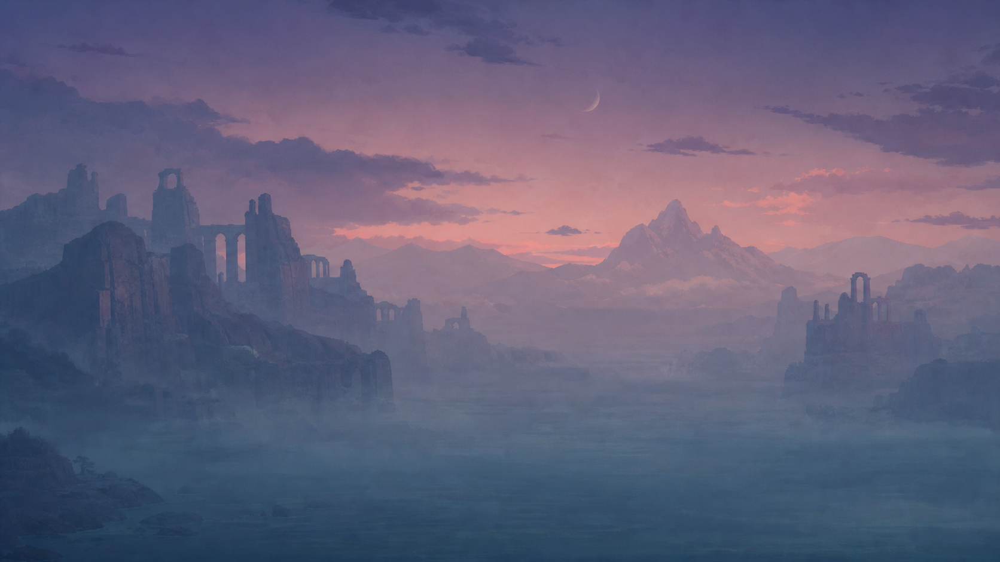
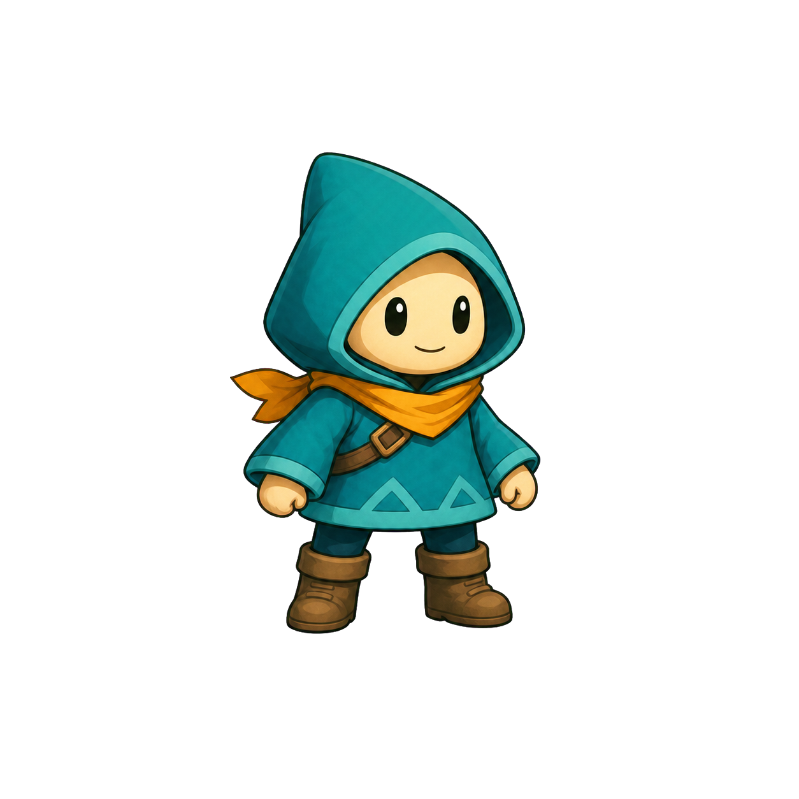
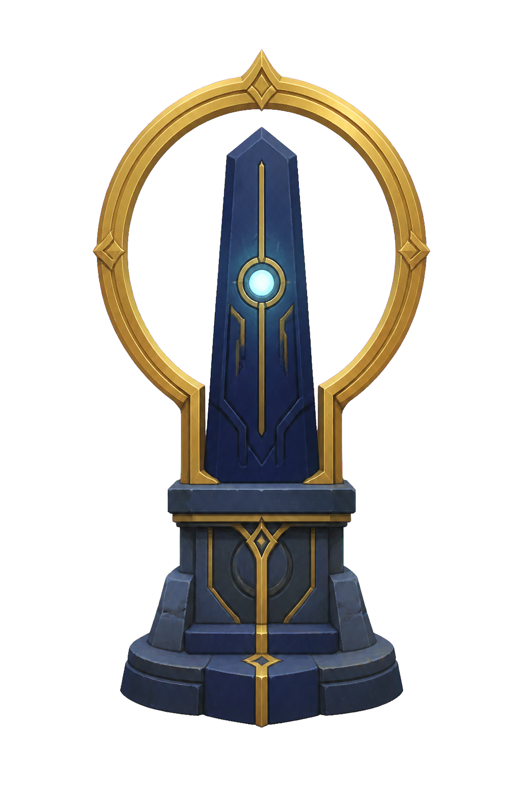
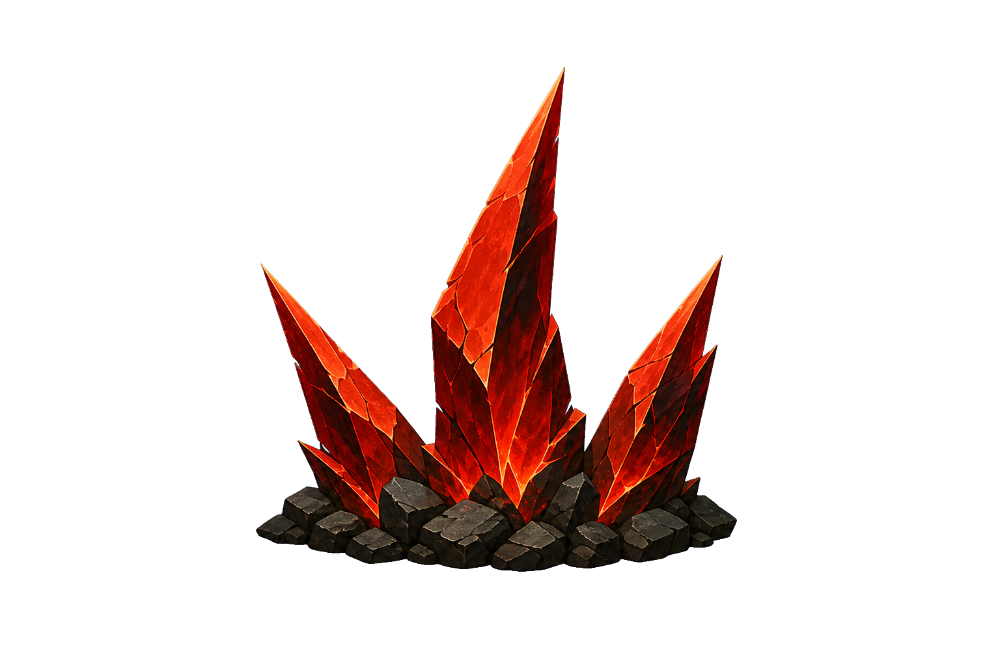
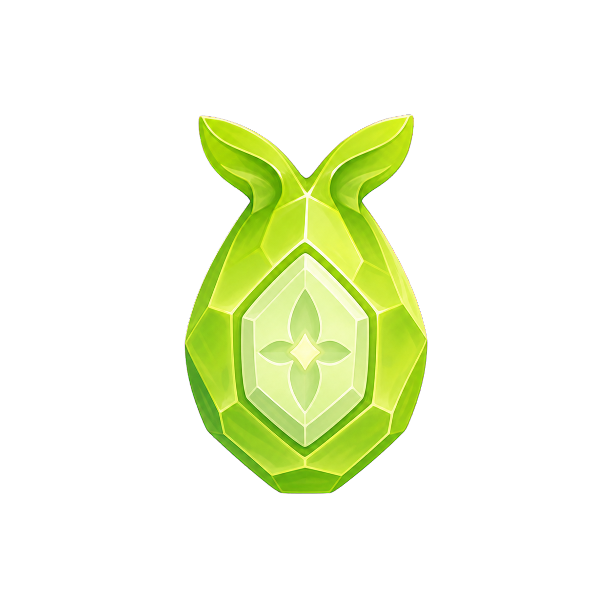
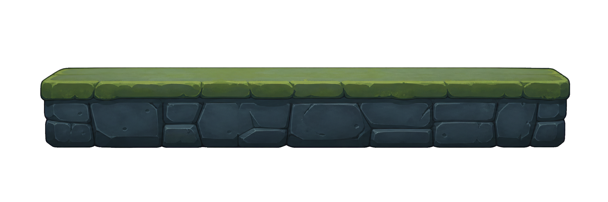
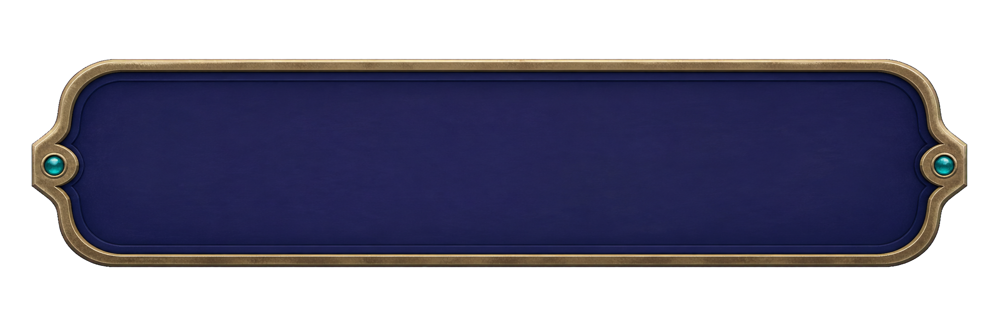

# Phase 4B Direct Art v2 — Readability Review Board

Work Package: `WP-2026W28-039`  
Status: `prototype_only_owner_approved_for_integration_planning` — no production approval

This v2 set responds to the recorded **Visual Readability Fail**. It is one
coherent art family, but gameplay objects are deliberately separated by both
silhouette and color. The intended order is:

`Player > Goal > Hazard = Item > Safe platform > HUD/status > Background`

## Background World Layer

| Asset | Intended game read | Visual guardrail |
|---|---|---|
| `background_world_layer_v2` | A single distant twilight ruin world | Keep behind gameplay at the lowest hierarchy. Do not derive collision, platforms, hazards, items, or goals from painted scenery. |

## Gameplay Objects

| Asset | Preview | Silhouette-first read | Supporting color | Required separation |
|---|---|---|---|---|
| Player |  | Compact hooded full body | Teal + cream + orange | Strongest readable foreground object; no combat implication. |
| Goal |  | Tall halo around a monolith | Gold + indigo + pale cyan | Destination, distinctly taller and less compact than the item. |
| Hazard |  | Jagged three-spike cluster | Red-orange + charcoal | Equal priority to the item but unmistakably dangerous. |
| Item |  | Rounded droplet seed with leaf fins | Lime + pale mint | Equal priority to hazard but no sharp silhouette and no currency read. |
| Safe platform |  | Broad horizontal slab with flat top | Slate + muted moss | Lower than goal/hazard/item; a safe traversal surface only. |

## UI

`ui_status_panel_v2` is intentionally empty. Timer, item, result, and retry
text must remain implementation-owned and readable; this image does not approve
a title screen, settings screen, save flow, or menu system.

## Evidence and boundaries

- Prompt-to-source mapping: `prompts.json`
- Hash, dimensions, post-processing, status: `manifest.json` and `manifest.csv`
- Sprite/UI images were generated on a flat `#ff00ff` background and converted
  to alpha PNGs with the imagegen chroma-key helper.
- All generated assets remain prototype-only and production-candidate. BK/Human
  Creative Owner approved integration planning on 2026-07-10; a separate
  Implementation Work Package is still required before scene use.
