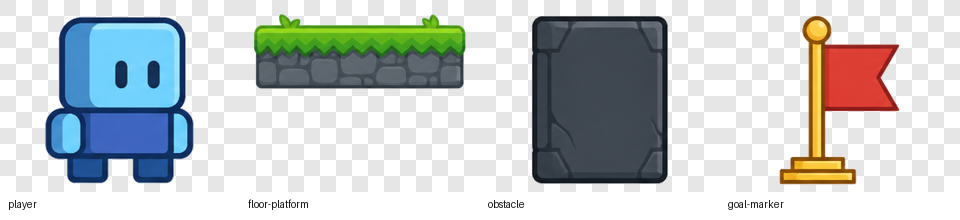
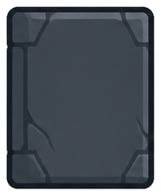
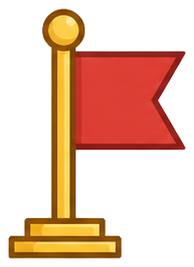
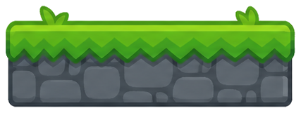

# Phase 4B Asset Reuse Preview

## Status

This is a review surface for WP-032. It does not approve final art direction,
production asset usage, Godot import, or implementation.

No new image generation was performed. The candidates below reuse existing Phase
3E prepared transparent PNGs where the role mapping is plausible. Gaps are
recorded explicitly where reuse would be misleading.

## Owner Review Options

For each role, BK/Human Creative Owner can choose:

- approve reuse for Phase 4B prototype review
- redirect to new Art candidate generation
- reject the role/candidate mapping
- allow placeholder-only implementation for that role

## Candidate Summary

| required_asset_id | role | reuse_decision | existing_source_path | owner_review_status |
|---|---|---|---|---|
| REQ-P4B-001 | hazard | candidate_with_readability_risk | `art_candidates/phase3e/prepared/P3E-obstacle-v1-transparent.png` | pending |
| REQ-P4B-002 | collectible | no_clear_reuse_candidate | none | pending |
| REQ-P4B-003 | goal | recommended_reuse_candidate | `art_candidates/phase3e/prepared/P3E-goal-marker-v1-transparent.png` | pending |
| REQ-P4B-004 | section_landmark | candidate_with_collision_alignment_risk | `art_candidates/phase3e/prepared/P3E-floor-platform-v1-transparent.png` | pending |

## Preview Links

Existing Phase 3E prepared preview:

Hazard candidate:

Goal candidate:

Section landmark candidate:

## Review Notes

### REQ-P4B-001 hazard

Candidate: `P4B-hazard-reuse-P3E-obstacle-v1`

This is usable only if BK accepts the obstacle visual as a prototype hazard or
moving-obstacle signifier. Risk: it may read as a static blocker rather than
danger. If approved, implementation should still use a separate hazard trigger
such as an `Area2D`; the visual should not define collision or gameplay by
itself.

### REQ-P4B-002 collectible

Candidate: `P4B-collectible-gap-v1`

No clear reuse candidate exists. Reusing the goal marker or obstacle would blur
progression semantics. Recommended owner decision is either new Art generation
in a later WP or placeholder-only collectible geometry for the Phase 4B
prototype.

### REQ-P4B-003 goal

Candidate: `P4B-goal-reuse-P3E-goal-marker-v1`

This is the strongest reuse candidate. It directly supports the Phase 4B need
for at least one imported gameplay-readable asset category while keeping scope
small. If approved, implementation should use it as a visual marker only and
keep goal trigger/progression logic separate.

### REQ-P4B-004 section_landmark

Candidate: `P4B-section-reuse-P3E-floor-platform-v1`

This can support section readability or surface identity, but has collision
alignment risk. If approved, implementation should keep collision simple and
not add slopes, moving platforms, or tile-system scope.
